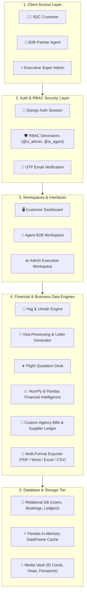
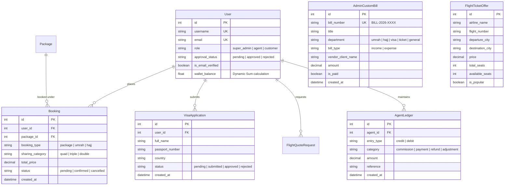

# 🏛️ GOLDEN STAR TRAVEL & TOURS — FULL PROJECT MASTER ARCHITECTURE

## 📌 Executive Summary
**Golden Star Travel & Tours** is an enterprise-grade Travel Management, B2B Agent Wholesale Network, and Financial Intelligence Platform built using **Django 5 (Python 3.14), Python NumPy & Pandas Data Engine, HTML5/Vanilla CSS, and Chart.js**.

The system features a **3-Tier Role-Based Access Control (RBAC)** architecture serving **B2C Customers, B2B Partner Agents, and Super Admins**.

---

## 🗂️ 1. Directory Structure & App Tree

```
travel-agecny-main/
│
├── PROJECT_ARCHITECTURE.md                  # Master System Architecture Document
│
└── core_admin/                              # Django Project Core Directory
    ├── manage.py                            # Django Administrative CLI
    ├── db.sqlite3                           # Relational Database
    │
    ├── config/                              # Global Configuration Package
    │   ├── settings.py                      # Installed Apps, DB, Middleware, Static/Media setup
    │   ├── urls.py                          # Global URL Route Dispatcher
    │   ├── wsgi.py                          # WSGI Application Entry Point
    │   └── asgi.py                          # ASGI Application Entry Point
    │
    ├── apps/                                # Modular Application Business Logic
    │   ├── accounts/                        # Custom User Model, RBAC Auth, Agent Ledger, Financial APIs
    │   │   ├── models.py                    # User, LoginHistory, AgentLedger, AdminCustomBill, AgentReview
    │   │   ├── views.py                     # Financial Analytics, Export APIs, Accounts Management
    │   │   └── urls.py                      # Auth routes
    │   │
    │   ├── packages/                        # Hajj, Umrah, & Tour Packages Engine
    │   │   ├── models.py                    # Package, PackageFeature, PackageInclude, PackageExclude
    │   │   └── views.py                     # Package catalogs & detail views
    │   │
    │   ├── bookings/                        # Order Booking & Reservations System
    │   │   ├── models.py                    # Booking, PassengerDetail
    │   │   └── views.py                     # Package booking submission & management
    │   │
    │   ├── visa/                            # Visa Application & Embassy Tracking Desk
    │   │   ├── models.py                    # VisaCountry, VisaPackage, VisaApplication
    │   │   └── views.py                     # Visa applications & instant approval letter generator
    │   │
    │   ├── flights/                         # Flight Tickets & Quotations Desk
    │   │   ├── models.py                    # FlightTicketOffer, FlightQuoteRequest
    │   │   └── views.py                     # Flight quotes & catalog engine
    │   │
    │   └── blog/                            # Travel Insights & Article Engine
    │       ├── models.py                    # BlogCategory, BlogArticle
    │       └── views.py                     # Articles catalog & detail views
    │
    └── templates/                           # Frontend HTML Template Architecture
        ├── base.html                        # Global Base Layout
        │
        ├── dashboard/                       # 3-Tier Dashboard Workspaces
        │   ├── admin/
        │   │   └── overview.html            # Super Admin Workspace (Analytics, Ledgers, Visas, Bills)
        │   ├── agent/
        │   │   └── overview.html            # B2B Partner Agent Workspace (Commissions, Sub-Bookings)
        │   └── customer/
        │       └── overview.html            # B2C Customer Workspace (Bookings, E-Tickets, Letters)
        │
        ├── letters/
        │   └── approval_letter.html         # Modern Official Visa Approval Letter (Printable Single-Page)
        │
        ├── reports/
        │   └── report_printable.html        # Executive System Report Layout (Printable Single-Page)
        │
        ├── packages/                        # Package Catalogs (Hajj, Umrah, Details)
        ├── visa/                            # Visa Catalogs & Application Forms
        ├── flights/                         # Flight Ticket Catalogs & Quotations
        └── blog/                            # Travel Articles & News Templates
```

---

## 🧭 2. Full System Flow & Component Interaction Architecture



---

## 💾 3. Database Schema & Data Models Relationship (ERD)



---

## ⚡ 4. Core Subsystem Architectural Highlights

### A. 🧮 Real-Time NumPy & Pandas Analytics Engine
- **In-Memory Analytical Pipeline**: Converts transactional queries (`Booking`, `FlightQuoteRequest`, `VisaApplication`) into Pandas `DataFrame` objects.
- **Statistical Vectorization**: Server computes Gross Volume, Confirmed Revenue, Pending Receivables, Average Order Value (AOV), Median Order Size (`np.median`), and Standard Deviation (`np.std`) in memory with zero database locks.
- **Chart.js Integration**: Streams real-time trends into Chart.js canvas line charts.

---

### B. 🧾 Manual Agency Bills & Multi-Format Exporter
- **Supplier Invoice Ledger**: Admins generate custom bills and supplier receipts (Saudi Hotels, Transport Vouchers, Visa Fees, Flight Vouchers).
- **4-Format Exporter**:
  1. 📄 **PDF**: Modern 1-page executive printable template (`report_printable.html`).
  2. 📝 **Word (`.doc`)**: Structured HTML Word document attachment.
  3. 📊 **Excel (`.xls`)**: Formatted Microsoft Excel spreadsheet with dark table headers.
  4. 📑 **CSV (`.csv`)**: Standard comma-separated values file.

---

### C. 🖨️ Tab-Closing Printable Document System
- All approval letters (`approval_letter.html`) and system reports (`report_printable.html`) utilize the smart back-button logic:
```javascript
function goBackOrClose() {
    if (window.history.length > 1 && document.referrer) {
        window.history.back();
    } else {
        window.close();
    }
}

```

---

### D. 🔒 Enterprise Security & Protection Stack
- **PBKDF2 SHA-256 Hashing**: Password storage is salted and hashed.
- **RBAC Decorators**: Custom `@user_passes_test(is_admin)` and `@user_passes_test(is_agent)` view guards.
- **CSRF & XSS Hardening**: Mandatory `X-CSRFToken` verification and front-end HTML entity escaping (`escapeHTML()`).
- **Parameterized SQL**: All database operations execute through Django ORM parameterized queries, completely eliminating SQL injection vectors.
- **SMTP OTP Engine**: 6-digit cryptographic verification codes sent via email.
