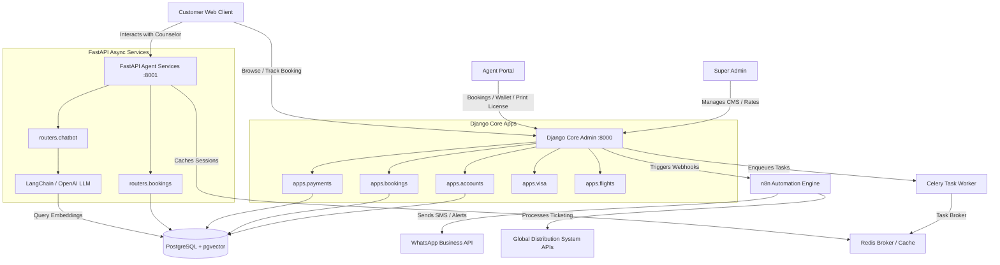

# Golden Star Agency — B2B2C Multi-Tenant Travel Platform

git init

---

## 🏗️ System Architecture & Data Flow

Golden Star Travel Network is built using a modern, decoupled microservices architecture designed to scale. It consists of:
1. **Core Admin CMS (Django)**: Acts as the primary relational database owner, handling B2B/B2C logic, CRM, wallets, blogs, and agent portals.
2. **Async API Layer (FastAPI)**: Serves high-frequency requests, automated flight engines, and AI Chatbot retriever endpoints.
3. **Workflow Automations (n8n)**: Orchestrates external API integrations, WhatsApp alerts, and customer notifications.
4. **Data Tier (PostgreSQL + pgvector & Redis)**: Handles relational data, vectors for semantic search, and task queue brokers.

### 📊 Visual Architecture Diagram



---

## 📦 Modular Subsystem & App Breakdown

The codebase is split into specific apps inside `core_admin/apps/` to isolate domains:

### 1. `apps.accounts`
- **Role:** Handles core user profiles, authentication lifecycles, and advanced security.
- **Features:**
  - Role-based authorization layers supporting `super_admin`, `agent`, and `customer`.
  - Non-blocking email authentication and OTP validation. OTP tokens expire strictly after 300 seconds (5 minutes).
  - AJAX verification updates with asynchronous email dispatching to keep request times under 10ms.

### 2. `apps.companies`
- **Role:** B2B tenant management.
- **Features:**
  - Controls partner agency profiles, credit metrics, and commission assignments.
  - Links travel agents to their respective agencies, enabling tiered pricing visibility.

### 3. `apps.customers`
- **Role:** B2C customer profile data.
- **Features:**
  - Manages travelers' documents, encrypted CNIC uploads, passport numbers, and historic booking logs.

### 4. `apps.packages`
- **Role:** Central inventory manager.
- **Features:**
  - Dynamic catalogs for Umrah itineraries, Hajj details, and family holiday packages.
  - Controls custom hotel configurations, flight inclusions, base costings, and customizable margins.

### 5. `apps.bookings`
- **Role:** Core order checkout engine.
- **Features:**
  - Handles shopping carts, package reservations, custom payment stages, and booking logs.
  - Automatically generates unique, searchable alphanumeric references for real-time customer tracking.

### 6. `apps.visa`
- **Role:** Dedicated visa tracker.
- **Features:**
  - Guides customers through document checklists for international travel (Saudi Arabia, Turkey, UAE, UK, etc.).
  - Tracks applications from submission through embassy processing to final approval/rejection.

### 7. `apps.flights`
- **Role:** Flight ticketing services.
- **Features:**
  - Manages flight quotation requests, airline classes, transit stops, and ticketing issues.

### 8. `apps.payments`
- **Role:** Financial ledger.
- **Features:**
  - Implements partner B2B wallets.
  - Records payments, commission breakdowns, settlements, and gateway receipts.

### 9. `apps.notifications`
- **Role:** Automated communication center.
- **Features:**
  - Dispatches transactional emails, browser alerts, and links into external webhook services for instant WhatsApp notification alerts.

### 10. `apps.content`
- **Role:** CMS elements.
- **Features:**
  - Governs pages, infinite-scrolling testimonials sliders, video upload grids, and lightbox modals.

### 11. `apps.blog`
- **Role:** Publishing interface.
- **Features:**
  - Features category filters, social share modules, read time calculators, and trending highlights.

### 12. `apps.common`
- **Role:** Core shared codebase utilities.
- **Features:**
  - Stores date helpers, text sanitization, validation regexes, and template helpers.

---

## 🧠 Deep-Dive Subsystem Architecture

### 1. Database Operations & Cross-Service Transactions
- **Shared PostgreSQL Schema:** To maintain data integrity without synchronization lag, the core Django ORM and FastAPI SQLAlchemy models connect to the same PostgreSQL database instance. Django is the single source of truth for database schemas and manages migrations (`python manage.py migrate`). FastAPI reads directly from the Django tables (e.g. `packages_package` is mapped to FastAPI SQLAlchemy models and queried by async API routers).
- **FastAPI SQLAlchemy Connection Pooling:** To handle concurrent traffic, FastAPI sets up SQLAlchemy pooling with parameters:
  - `pool_size=10`: Keeps up to 10 persistent connections open in the pool.
  - `max_overflow=20`: Allows up to 20 additional temporary connections under high load.
  - `pool_pre_ping=True`: Verifies connection health before executing commands to avoid stale connection bugs.
  - `get_db()` Context Manager: Yields a session per request and calls `db.close()` in a `finally` block to return connections immediately to the pool.
- **AI Chatbot pgvector Similarity Engine:**
  - The AI travel agent converts queries into 384-dimensional semantic vectors using the local sentence transformer model (`all-MiniLM-L6-v2`).
  - It then executes a cosine distance vector similarity query in PostgreSQL using the `<->` operator:
    ```sql
    SELECT id, title, description, price, category, (embedding <-> :vector) AS distance
    FROM packages_package
    ORDER BY distance ASC LIMIT :limit;
    ```
  - **Failsafe Core Fallback:** If the PostgreSQL server does not have the `pgvector` extension enabled, the system catches the database error and runs a Python NumPy fallback, computing cosine similarity locally on package lists:
    ```python
    dot_product = np.dot(query_vector, db_vector)
    similarity = dot_product / (norm_q * norm_db)
    ```

### 2. Asynchronous Non-Blocking Email/OTP Delivery
- **Threaded Worker Daemon:** Sending emails over network sockets using SMTP is a blocking operation that would increase HTTP response times. To keep verification requests under 10ms, Django uses a multi-threaded delivery worker:
  ```python
  def send_verification_email(user):
      t = threading.Thread(target=_send_verification_email_sync, args=(user,))
      t.daemon = True
      t.start()
  ```
  Spawning this daemon thread frees up the main request thread to immediately return a JSON response to the browser, while the background thread communicates with the SMTP mail server.
- **OTP Verification Security Lifecycle:**
  - During verification, the `User` model tracks `email_verification_code`, `otp_created_at`, and `is_email_verified`.
  - When verifying, the system checks expiration against a 300-second (5-minute) TTL limit:
    ```python
    if timezone.now() - user.otp_created_at > timedelta(seconds=300):
        # Reject: Code is expired
    ```
  - Regenerating an OTP updates `email_verification_code` with a new 6-digit random string and resets `otp_created_at` to `timezone.now()`.

### 3. Real-Time Dashboard Syncing
- **Asynchronous AJAX Polling:** Rather than full page reloads, the dashboard interface implements non-blocking client-side polling.
- **Implementation:** 
  - On page load, `DOMContentLoaded` registers background worker timers:
    ```javascript
    syncData(); // Runs every 4 seconds to query '/dashboard/agent/api/overview-stats/'
    setInterval(syncData, 4000);
    
    loadCharts(); // Runs every 30 seconds to query '/dashboard/agent/chart/data/'
    setInterval(loadCharts, 30000);
    ```
  - The UI loader is shown and hidden gracefully during data updates, keeping widgets and visual canvas charts accurate without user intervention.

---

## 🛠️ Step-by-Step Setup Guide

### 1. Prerequisites
Ensure you have the following installed on your machine:
- **Python 3.10+** (add to system path)
- **PostgreSQL 14+** (with the `pgvector` extension enabled)
- **Redis Server** (for Celery and session caching)
- **Node.js** (optional, if customizing n8n or build tools)

### 2. Clone the Repository
```bash
git clone https://github.com/your-org/travel-agency-main.git
cd travel-agency-main
```

### 3. Virtual Environment & Dependencies
Create a virtual environment and install standard requirements:
```powershell
# Create environment
python -m venv venv

# Windows PowerShell Activation:
.\venv\Scripts\Activate.ps1

# Linux/macOS Activation:
source venv/bin/activate

# Install dependencies
pip install -r requirements.txt
```

### 4. Configuration Variables
Copy `.env.example` to `.env` and fill out your variables:
```bash
cp .env.example .env
```
Ensure your database parameters inside `.env` align with your PostgreSQL installation:
```ini
DB_NAME=travel_db
DB_USER=postgres
DB_PASSWORD=your_password
DB_HOST=127.0.0.1
DB_PORT=5432
REDIS_URL=redis://127.0.0.1:6379/0
```

### 5. Database Initialization
Compile Django migrations and seed database records:
```bash
cd core_admin
python manage.py migrate

# Seed core system variables, blogs, reviews, and test accounts
python seed_blogs.py
python seed_reviews.py
```

To seed specific dummy data for testing the agent dashboard charts, return to the root folder and run:
```bash
python scripts/seed_agent_data.py
```
*This populates agent `Danish` (username: `Danish`, password: `password123`) with 7 bookings, 5 visa applications, and 6 flight quote requests.*

### 6. Starting Services
#### Running Django Core (Port 8000)
```bash
cd core_admin
python manage.py runserver 127.0.0.1:8000
```

#### Running FastAPI Async Services (Port 8001)
```bash
# In a new terminal tab (within venv):
uvicorn fast_api.main:app --host 127.0.0.1 --port 8001 --reload
```

#### Running Celery Background Worker
```bash
# In a new terminal tab (within venv):
cd core_admin
celery -A config worker --loglevel=info
```

---

## 🧪 Testing Suites

Run tests inside the isolated `tests/` directory to bypass database initialization issues in python helper scripts:
```bash
# Execute unit testing suite
venv\Scripts\pytest tests/
```

---

## 🔮 Next Phase Roadmap

Here is the implementation plan for our next developmental sprint:

- [ ] **Global Distribution System (GDS) API Integration:** Connect the flights app to Sabres/Amadeus mock endpoints to search and book live ticketing options.
- [ ] **B2B Payment Settlement Gateway:** Integrate localized digital payment APIs (EasyPaisa, JazzCash, HBL) for instant B2B wallet refills.
- [ ] **WhatsApp Bot Notification Triggering:** Enhance the n8n automation flow to dispatch PDF booking vouchers directly to customers upon approval.
- [ ] **AI Recommendation Enhancements:** Expand the LangChain chatbot to search vectors of user preferences, suggesting personalized visit visa guidelines.
